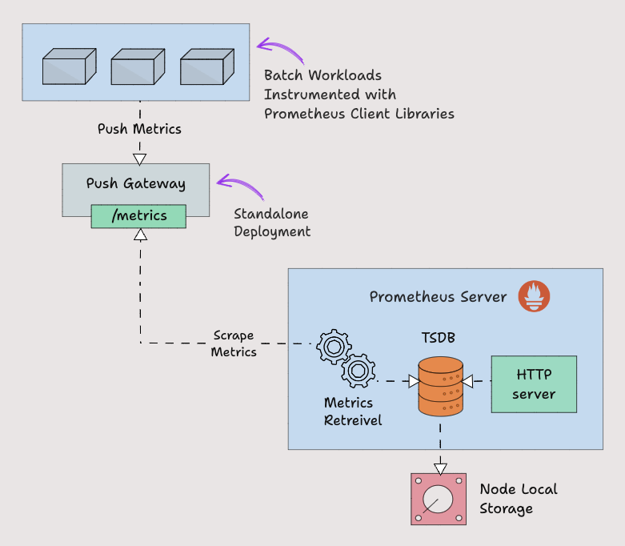

  <h1 align="center">Pushgateway Prometheus Push Gateway</h1>
  

    <a href="README.md"><strong>English</strong></a> | <strong>简体中文</strong>
  

## Table of Contents

- [Repository Introduction](#repository-introduction)
- [Prerequisites](#prerequisites)
- [Image Specifications](#image-specifications)
- [Getting Help](#getting-help)
- [How to Contribute](#how-to-contribute)

## Repository Introduction
‌[Pushgateway‌](https://github.com/prometheus/pushgateway) Pushgateway is an intermediate proxy component in the Prometheus ecosystem, designed to receive monitoring metric data actively pushed by short-term tasks (such as scheduled jobs and temporary services), which is then periodically fetched by Prometheus.

**Core Features:**
1. Temporary Task Metrics Storage: Pushgateway is specifically designed for monitoring metrics with short lifecycles (such as batch processing tasks and scheduled tasks), allowing these tasks to push metrics to Pushgateway for temporary storage before exiting, which Prometheus can then periodically pull. For example, after a CronJob task completes, it pushes execution duration and status metrics like job_duration_seconds{job="batch-job"}.
2. Service Discovery Bridging: Addresses scenarios where direct monitoring via Prometheus Pull mode is not feasible (such as firewall restrictions or short-lived tasks). Pushgateway acts as an intermediary proxy, receiving pushed metrics and exposing them to Prometheus, thereby expanding the scope of monitoring.
3. Metric Persistence and Caching: Pushed metrics are persisted in Pushgateway's memory until they are pulled by Prometheus or manually deleted. It supports setting honor_labels: true to retain original labels, avoiding metric conflicts.
4. Grouping Label Support: Supports managing metrics in groups through grouping_key (e.g., {job="my_job", instance="batch-instance"}). Metrics within the same group can be replaced or deleted as a whole, facilitating batch updates of task metrics.
5. Simple API Interface: Provides RESTful API support for pushing metrics via HTTP PUT/POST methods (in text or Protobuf format).
6. Native Integration with Prometheus: Prometheus automatically pulls metrics exposed by Pushgateway through static configuration or service discovery, without the need for additional adaptation. The metric path is typically /metrics/job/<JOB_NAME>{/<LABEL_NAME>/<LABEL_VALUE>}.
7. Manual Cleanup Mechanism: Offers an API for manually deleting expired metrics (e.g., DELETE /metrics/job/<JOB_NAME>), preventing the accumulation of invalid data. Suitable for scenarios where tasks are actively cleaned up after completion.
8. Lightweight Design: Deployed as a single process with low resource consumption, it can run separately from Prometheus instances and supports containerized deployment (the official Docker image is approximately 15MB).

This project offers pre-configured [**`Pushgateway-Prometheus Push Gateway`**]()，images with Pushgateway and its runtime environment pre-installed, along with deployment templates. Follow the guide to enjoy an "out-of-the-box" experience.

**Architecture Design:**

> **System Requirements:**
> - CPU: 4vCPUs or higher
> - RAM: 16GB or more
> - Disk: At least 50GB

## Prerequisites
[Register a Huawei account and activate Huawei Cloud](https://support.huaweicloud.com/usermanual-account/account_id_001.html)

## Image Specifications

| Image Version          | Description | Notes |
|------------------------| --- | --- |
| [Pushgateway1.11.1-kunpeng-v1.0](https://github.com/HuaweiCloudDeveloper/prometheus-pushgateway-image/tree/Pushgateway1.11.1-kunpeng-v1.0?tab=readme-ov-file) | Deployed on Kunpeng servers with Huawei Cloud EulerOS 2.0 64bit |  |

## Getting Help
- Submit an [issue](https://github.com/HuaweiCloudDeveloper/prometheus-pushgateway-image/issues)
- Contact Huawei Cloud Marketplace product support

## How to Contribute
- Fork this repository and submit a merge request.
- Update README.md synchronously based on your open-source mirror information.