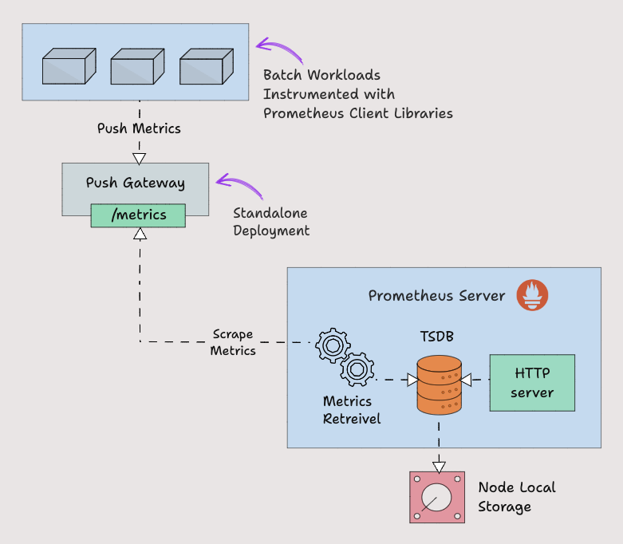

  <h1 align="center">Pushgateway Prometheus推送网关</h1>
  

    <a href="README.md"><strong>English</strong></a> | <strong>简体中文</strong>
  

## 目录

- [仓库简介](#项目介绍)
- [前置条件](#前置条件)
- [镜像说明](#镜像说明)
- [获取帮助](#获取帮助)
- [如何贡献](#如何贡献)

## 项目介绍
‌[Pushgateway‌](https://github.com/prometheus/pushgateway) Pushgateway 是 Prometheus 生态中的 ‌中间代理组件‌，用于接收短期任务（如定时作业、临时服务）主动推送的监控指标数据，再由 Prometheus 定期拉取。

**核心特性：**
1. 临时任务指标暂存：Pushgateway 专为短暂生命周期（如批处理任务、定时任务）的监控指标设计，允许这些任务在退出前将指标推送到 Pushgateway 暂存，供 Prometheus 定期拉取。例如，CronJob 任务完成后推送执行耗时和状态指标 job_duration_seconds{job="batch-job"}。
2. 服务发现桥接：解决无法直接通过 Prometheus Pull 模式监控的场景（如防火墙限制或短时任务）。Pushgateway 作为中间代理，接收推送的指标并暴露给 Prometheus，扩展了监控覆盖范围。
3. 指标持久化与缓存：推送的指标会持久化在 Pushgateway 内存中，直到被 Prometheus 拉取或手动删除。支持设置 honor_labels: true 保留原始标签，避免指标冲突。
4. 分组标签支持：支持通过 grouping_key（如 {job="my_job", instance="batch-instance"}）对指标分组管理，同一组的指标会被整体替换或删除，便于批量更新任务指标。
5. 简单API接口：提供 RESTful API 支持 HTTP PUT/POST 方式推送指标（文本或 Protobuf 格式）。
6. 与Prometheus原生集成：Prometheus 通过静态配置或服务发现自动拉取 Pushgateway 暴露的指标，无需额外适配。指标路径通常为 /metrics/job/<JOB_NAME>{/<LABEL_NAME>/<LABEL_VALUE>}。
7. 手动清理机制：提供 API 手动删除过期指标（如 DELETE /metrics/job/<JOB_NAME>），避免堆积无效数据。适合任务完成后主动清理场景。
8. 轻量级设计：单进程部署，资源消耗低，可与 Prometheus 实例分离运行，支持容器化部署（官方 Docker 镜像约 15MB）。

本项目提供的开源镜像商品 [**`Pushgateway-推送网关`**]()，已预先安装 Pushgateway 软件及其相关运行环境，并提供部署模板。快来参照使用指南，轻松开启“开箱即用”的高效体验吧。

**架构设计：**

> **系统要求如下：**
> - CPU: 4vCPUs 或更高
> - RAM: 16GB 或更大
> - Disk: 至少 50GB

## 前置条件
[注册华为账号并开通华为云](https://support.huaweicloud.com/usermanual-account/account_id_001.html)

## 镜像说明

| 镜像规格                                                                                                                                                          | 特性说明 | 备注 |
|---------------------------------------------------------------------------------------------------------------------------------------------------------------| --- | --- |
| [Pushgateway1.11.1-kunpeng-v1.0](https://github.com/HuaweiCloudDeveloper/prometheus-pushgateway-image/tree/Pushgateway1.11.1-kunpeng-v1.0?tab=readme-ov-file) | 基于鲲鹏服务器 + Huawei Cloud EulerOS 2.0 64bit 安装部署 |  |

## 获取帮助
- 更多问题可通过 [issue](https://github.com/HuaweiCloudDeveloper/prometheus-pushgateway-image/issues) 或 华为云云商店指定商品的服务支持 与我们取得联系
- 其他开源镜像可看 [open-source-image-repos](https://github.com/HuaweiCloudDeveloper/open-source-image-repos)

## 如何贡献
- Fork 此存储库并提交合并请求
- 基于您的开源镜像信息同步更新 README.md